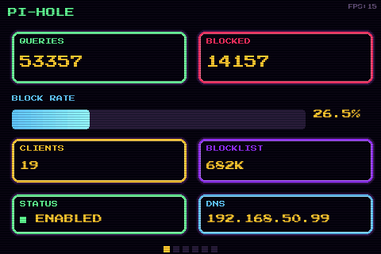
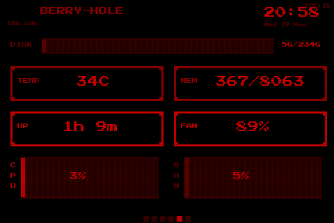
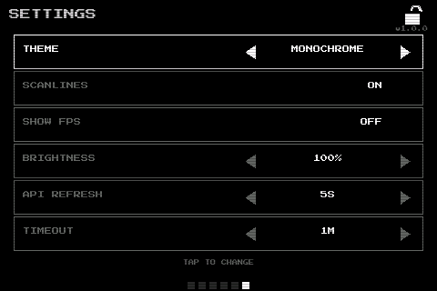

# Cutie-Pi

A pixel-art dashboard for Pi-hole on small LCD screens. Inspired by retro aesthetic.

  

## Features

- 6 swipeable screens: Stats, Graph, Top Blocked, Clients, System Info, Settings
- Pixel-art 8-bit style with Press Start 2P font
- Touch and keyboard navigation
- Real-time system monitoring (CPU, RAM, Temp, Fan, Disk)
- Multiple color themes (default, monochrome, neon, ocean, sunset, matrix, cyberpunk, 666)
- Scanline CRT effect (toggleable)
- Display sleep/wake on touch
- Configurable API refresh rate and screen timeout

## Requirements

- Raspberry Pi with LCD screen (tested on 3.5" 480x320)
- Pi-hole v6
- Python 3.10+

## Installation

### Quick Install

```bash
curl -sSL https://raw.githubusercontent.com/rennf93/cutie-pi/v1.1.0/install.sh | sudo bash
```

### With Options

```bash
curl -sSL https://raw.githubusercontent.com/rennf93/cutie-pi/v1.1.0/install.sh | sudo bash -s -- \
  --pihole-password "yourpass" \
  --theme neon
```

### Clone & Install

```bash
git clone --depth 1 --branch v1.1.0 https://github.com/rennf93/cutie-pi.git
cd cutie-pi
sudo bash install.sh --pihole-password "yourpass"
```

### Update Existing Installation

```bash
curl -sSL https://raw.githubusercontent.com/rennf93/cutie-pi/v1.1.0/install.sh | sudo bash -s -- --update
```

### Installation Options

```
Options:
  --pihole-password PASSWORD   Pi-hole API password
  --pihole-api URL             Pi-hole API URL (default: http://localhost/api)
  --screen-width WIDTH         Screen width in pixels (default: 480)
  --screen-height HEIGHT       Screen height in pixels (default: 320)
  --theme THEME                Color theme (default: default)
  --update                     Update existing installation (preserves config)
  --help                       Show all options
```

### Available Themes

- `default` - Classic Pi-hole (multi-color)
- `monochrome` - Black and white
- `neon` - Hot pink/magenta
- `ocean` - Blue tones
- `sunset` - Orange/amber tones
- `matrix` - Green only
- `cyberpunk` - Pink and cyan
- `666` - Red only

## Configuration

Configuration is stored in `/etc/cutie-pi/config`:

```bash
# Pi-hole API settings
CUTIE_PIHOLE_API="http://localhost/api"
CUTIE_PIHOLE_PASSWORD="your_password"

# Display settings
CUTIE_SCREEN_WIDTH="480"
CUTIE_SCREEN_HEIGHT="320"
CUTIE_FPS="30"

# Theme
CUTIE_THEME="default"

# Update intervals (seconds)
CUTIE_API_INTERVAL="5"
CUTIE_SYSTEM_INTERVAL="2"
```

## Usage

```bash
# Start
sudo systemctl start cutie-pi

# Stop
sudo systemctl stop cutie-pi

# Restart
sudo systemctl restart cutie-pi

# View logs
sudo journalctl -u cutie-pi -f

# Edit config
sudo nano /etc/cutie-pi/config
```

## Controls

- **Swipe left/right**: Change screens
- **Arrow keys**: Change screens
- **Tap**: Interact with settings
- **ESC**: Exit

## Settings Screen

Access by swiping to the last screen. Available settings:

- **Theme**: Cycle through color themes
- **Scanlines**: Toggle CRT effect ON/OFF
- **Show FPS**: Toggle FPS counter
- **Brightness**: Adjust display brightness (if supported)
- **API Refresh**: Set data refresh interval (5s, 10s, 30s, 60s)
- **Timeout**: Set display sleep timeout (Never, 1m, 5m, 10m, 30m)

## Uninstall

```bash
sudo bash /opt/cutie-pi/uninstall.sh
```

Or if you have the source:

```bash
sudo bash uninstall.sh
```

## Structure

```
cutie-pi/
├── main.py              # Entry point
├── config.py            # Configuration
├── __version__.py       # Version info
├── api/
│   └── pihole.py        # Pi-hole API client
├── screens/
│   ├── base.py          # Base screen class
│   ├── stats.py         # Pi-hole stats
│   ├── graph.py         # Query graph
│   ├── blocked.py       # Top blocked domains
│   ├── clients.py       # Top clients
│   ├── system.py        # System info
│   └── settings.py      # Settings screen
├── ui/
│   ├── colors.py        # Color definitions
│   ├── themes.py        # Theme system
│   ├── fonts.py         # Pixel font
│   └── components.py    # UI components
└── utils/
    └── system_info.py   # System info gathering
```

## License

MIT
